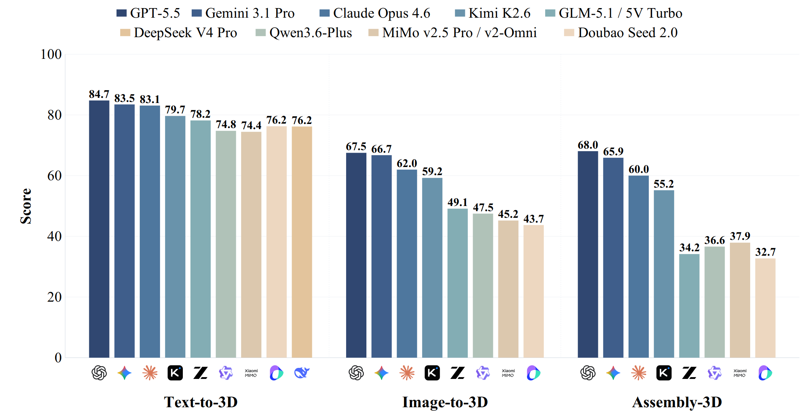
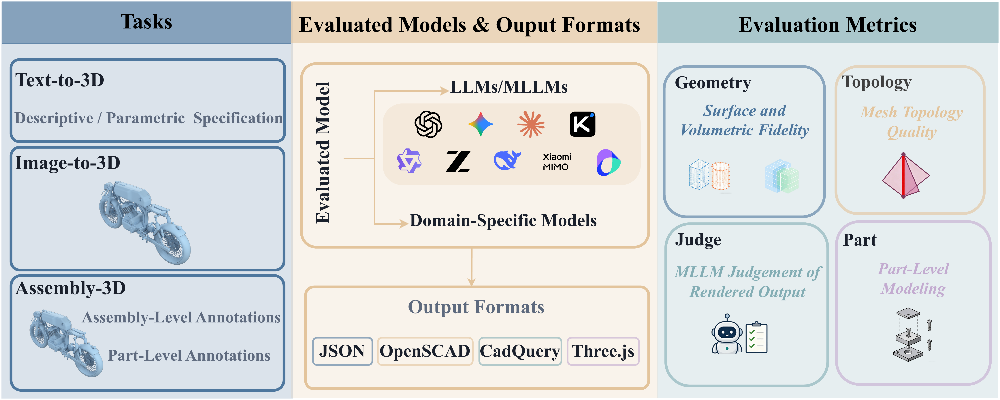
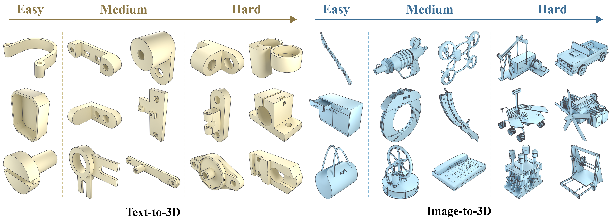

<div align="center">

# P3D-Bench

### Benchmarking MLLMs for Parametric 3D Generation and Structural Reasoning

[](https://lucasqaq.github.io/p3d/)
[](https://arxiv.org/abs/2606.11152)
[](https://huggingface.co/datasets/SpatiaOS/P3D-Bench)

<a href="https://kangyiyang.github.io/" target="_blank">Yikang Yang</a><sup>1,†</sup> · <a href="https://github.com/LucasQAQ" target="_blank">Zhanpeng Hu</a><sup>1,†</sup> · <a href="https://linyou.github.io" target="_blank">Youtian Lin</a><sup>1</sup> · <a href="https://scholar.google.com/citations?user=Cm4jMckAAAAJ&hl=zh-CN" target="_blank">Mengqi Zhou</a><sup>1</sup> · <a href="https://scholar.google.com/citations?user=4YPtwXYAAAAJ&hl=en&oi=ao" target="_blank">Jingxi Xu</a><sup>2</sup> · <a href="https://scholar.google.com/citations?user=nWT4vFcAAAAJ&hl=en" target="_blank">Feihu Zhang</a><sup>2</sup> · <a href="https://liujiaheng.github.io/" target="_blank">Jiaheng Liu</a><sup>1</sup> · <a href="https://yoyo000.github.io/" target="_blank">Yao Yao</a><sup>1,‡</sup>

<sup>1</sup>Nanjing University &nbsp;&nbsp; <sup>2</sup>Envision

<sub>† Equal contribution &nbsp;·&nbsp; ‡ Corresponding author</sub>



<sub><b>Scores of different models across the three tasks in P3D-Bench.</b> The Score is the average of the four bucket scores (Geometry, Topology, Judge, Part), rescaled to 0–100.</sub>

</div>

---

## News

- **[2026-06]** 🎉 We released **P3D-Bench** — the paper ([arXiv](https://arxiv.org/abs/2606.11152)), the evaluation code, and the **[Dataset](https://huggingface.co/datasets/SpatiaOS/P3D-Bench)** on HuggingFace.

---

## Abstract

Multimodal large language models can write code to produce complex programs as well as
use programs to do 3D modeling, which opens up a new avenue for 3D generation powered by
their priors, world knowledge and reasoning. Yet existing benchmarks rarely evaluate 3D
modeling through code. Such modeling demands more than runnable code: from a text or
visual specification, a model must generate a parametric 3D program that is geometrically
precise, semantically aligned and assembly-consistent.

We introduce **P3D-Bench**, a benchmark for parametric 3D generation. Unlike a 3D mesh, a
parametric 3D program exposes explicit dimensions, construction operations and part
relations, revealing whether a model recovers a design's structure, not just its
appearance. Under a unified protocol, P3D-Bench covers three task families
(**Text-to-3D**, **Image-to-3D** and **Assembly-3D**) and scores each output for
executability, geometric fidelity, topology, text-grounded constraints, multiview
semantic alignment and part-level structure. We evaluate frontier MLLMs and text-only LLMs
on **400 text cases, 400 image cases and 203 annotated assemblies**, with domain-specific
models as reference points.

Our extensive evaluation yields three findings. First, assemblies are the hardest setting,
where models still fail to compose multiple parts into a coherent structure. Second, models
can often recover the global shape and semantic identity of the target object, yet fail to
reproduce the precise parametric geometry specified by the input. Third, part-level
modeling remains weak on assemblies, where models recover neither the geometry of each part
nor the right number of parts. These results position P3D-Bench as a benchmark for
evaluating precise parametric geometry and part-level structure in parametric 3D generation.

---

## Environment Setup

### 1. Install

```bash
git clone https://github.com/SpatiaOS/P3D-Bench.git
cd P3D-Bench

# create an environment (conda or venv)
conda create -n p3dbench python=3.10 -y
conda activate p3dbench

# core install (CLI + model adapters + config)
pip install -e .
```

Heavy geometry/render dependencies are **optional extras**, installed only for the metric
buckets that need them. A metric whose dependency is missing reports it clearly instead of
crashing.

```bash
pip install -e ".[geometry]"   # OCC/OCP + trimesh → Geometry / Topology / Part metrics
pip install -e ".[render]"     # pyrender / Blender → Judge multiview renders
pip install -e ".[cadquery]"   # CadQuery output format
pip install -e ".[all]"        # everything
```

External runtimes (not pip extras): the **`openscad`** binary for the OpenSCAD format, and
**Node.js** for the Three.js format.

### 2. API keys

Bring your own keys. **Secrets never go in YAML** — `configs/models.yaml` holds only
metadata (provider, model id, base URL, and the *name* of the env var that holds the key);
`.env.example` lists the key names.

```bash
cp .env.example .env            # then fill in your keys
```

```bash
# .env  (key NAMES only; values stay local)
OPENAI_API_KEY=
ANTHROPIC_API_KEY=
GEMINI_API_KEY=
OPENROUTER_API_KEY=             # any OpenAI-compatible router
HF_TOKEN=                       # to download the full split
P3DBENCH_CACHE_DIR=.cache/p3dbench
```

Register a model by adding a block to `configs/models.yaml` and the matching key in `.env`.
Any OpenAI-compatible endpoint (OpenRouter, vLLM, LM Studio, …) works via the
`openai_compatible` provider:

```yaml
models:
  gpt-4o:
    provider: openai
    model: gpt-4o
    api_key_env: OPENAI_API_KEY
    base_url: https://api.openai.com/v1
    temperature: 0.0

  my-local-model:
    provider: openai_compatible
    model: qwen2.5-vl-instruct
    api_key_env: OPENROUTER_API_KEY
    base_url: https://your-router.example.com/v1
```

---

## Quick Start

<div align="center">

</div>

An evaluation run is defined by three orthogonal choices — **task**, **output format**, and
**metric bucket** — that you pin independently from the CLI:

| Axis        | Flag       | Choices |
|-------------|------------|---------|
| **Task**    | `--task`   | `text-to-3d` · `image-to-3d` · `assembly-3d` |
| **Format**  | `--format` | `minimal-json` · `openscad` · `cadquery` · `threejs` |
| **Metric**  | `--metric` | `valid` · `geometry` · `topology` · `judge` · `part` · `all` |

The CLI validates `--format` against the chosen task's supported formats.

**1. Get the demo data** (a few cases per task; full split on [HuggingFace](https://huggingface.co/datasets/SpatiaOS/P3D-Bench) — see [Dataset](#dataset)):

```bash
p3dbench download --split demo
```

**2. Run one task × one format × one metric, end-to-end:**

```bash
p3dbench run --task image-to-3d --format openscad --metric geometry \
  --model gpt-4o --split demo
```

`run` chains the four stages and writes results under `results/<run-id>/`. You can also run
each stage on its own — every stage reads/writes a plain JSONL artifact, with no
resume/checkpoint state — so you can re-score the *same* predictions under a different
metric without re-running inference:

```bash
p3dbench infer     --task text-to-3d --format cadquery --model gpt-4o   # → predictions.jsonl
p3dbench compile   --pred predictions.jsonl                              # → compiled.jsonl
p3dbench score     --compiled compiled.jsonl --metric topology           # → metrics.jsonl
p3dbench summarize --metrics metrics.jsonl                               # → summary.json
```

Useful flags: `--limit N` (first N cases), `--dry-run` (build prompts / validate config
without calling a model), `--split {demo,full}`, `--text-mode {parametric,descriptive}`
(Text-to-3D only — selects which metric panel is reported).

---

## Dataset

- **Demo split** (a few cases per task) ships in [`data/demo/`](data/demo/) with manifests
  under [`data/manifests/`](data/manifests/) — enough to smoke-test the whole pipeline.
- **Full P3D-Dataset** — 400 Text-to-3D / 400 Image-to-3D / 203 Assembly-3D cases,
  spanning easy → hard difficulty, on
  [🤗 HuggingFace](https://huggingface.co/datasets/SpatiaOS/P3D-Bench)
  (`p3dbench download --split full`):

<div align="center">

</div>

---

## License

Code and data are licensed separately, and the data follows the terms of its upstream
sources (**non-commercial research use only, with attribution**):

| Component | Source | License |
|-----------|--------|---------|
| **Benchmark code** (this repo) | — | MIT (see [LICENSE](LICENSE)) |
| **P3D-Dataset — Text-to-3D split** | derived from Text2CAD v1.1 | [CC BY-NC-SA 4.0](https://creativecommons.org/licenses/by-nc-sa/4.0/) |
| **P3D-Dataset — Image-to-3D & Assembly-3D splits** | derived from [Fusion 360 Gallery Dataset](https://github.com/AutodeskAILab/Fusion360GalleryDataset) | [Fusion 360 Gallery Dataset License](https://github.com/AutodeskAILab/Fusion360GalleryDataset/blob/master/LICENSE.md) (Autodesk, non-commercial) |

Both dataset sources permit **non-commercial research use only** and require
**attribution**; redistributed portions and modifications must carry the same
restrictions. By using the P3D-Dataset you agree to the upstream license terms.

---

## Citation

If you find P3D-Bench useful, please cite our paper:

```bibtex
@misc{yang2026p3dbenchbenchmarkingmllmsparametric,
      title={P3D-Bench: Benchmarking MLLMs for Parametric 3D Generation and Structural Reasoning}, 
      author={Yikang Yang and Zhanpeng Hu and Youtian Lin and Mengqi Zhou and Jingxi Xu and Feihu Zhang and Jiaheng Liu and Yao Yao},
      year={2026},
      eprint={2606.11152},
      archivePrefix={arXiv},
      primaryClass={cs.CV},
      url={https://arxiv.org/abs/2606.11152}, 
}
```
