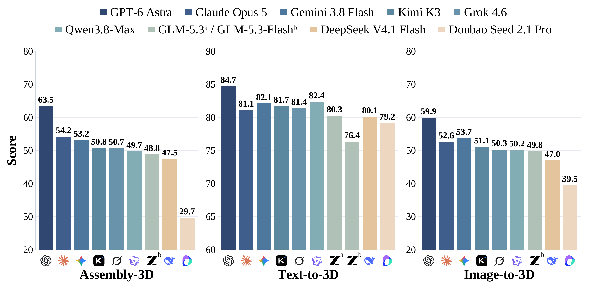
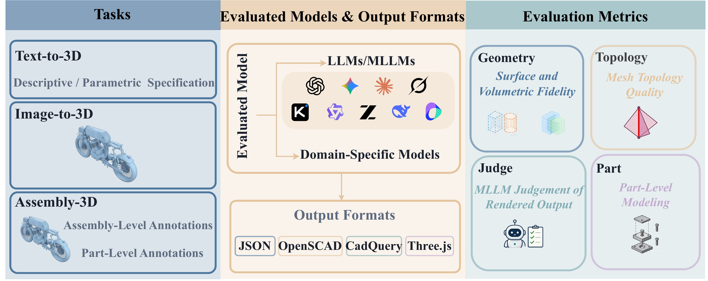
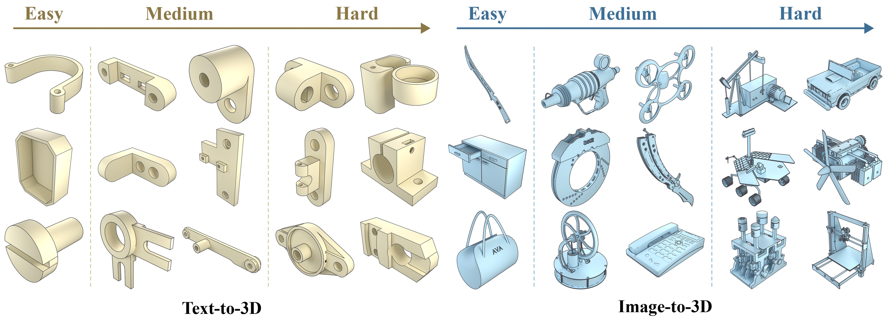

<div align="center">

# P3D-Bench

Text GT update: profile nesting and hole extrusion are corrected for four
reference programs. See [reference repairs and validation](docs/DATA.md#versioned-text-reference-repairs).

### Benchmarking MLLMs for Parametric 3D Generation and Structural Reasoning

[](https://spatiaos.github.io/projects/P3D-Bench)
[](https://spatiaos.github.io/projects/P3D-Bench/#leaderboard)
[](https://arxiv.org/abs/2606.11152)
[](https://huggingface.co/datasets/SpatiaOS/P3D-Bench)

<a href="https://kangyiyang.github.io/" target="_blank">Yikang Yang</a><sup>1,†</sup> · <a href="https://github.com/LucasQAQ" target="_blank">Zhanpeng Hu</a><sup>1,†</sup> · <a href="https://linyou.github.io" target="_blank">Youtian Lin</a><sup>1</sup> · <a href="https://scholar.google.com/citations?user=Cm4jMckAAAAJ&hl=zh-CN" target="_blank">Mengqi Zhou</a><sup>1</sup> · <a href="https://scholar.google.com/citations?user=4YPtwXYAAAAJ&hl=en&oi=ao" target="_blank">Jingxi Xu</a><sup>2</sup> · <a href="https://scholar.google.com/citations?user=nWT4vFcAAAAJ&hl=en" target="_blank">Feihu Zhang</a><sup>2</sup> · <a href="https://liujiaheng.github.io/" target="_blank">Jiaheng Liu</a><sup>1</sup> · <a href="https://yoyo000.github.io/" target="_blank">Yao Yao</a><sup>1,‡</sup>

<sup>1</sup>Nanjing University &nbsp;&nbsp; <sup>2</sup>Envision

<sub>† Equal contribution &nbsp;·&nbsp; ‡ Corresponding author</sub>



<sub><b>Model scores on 100-case subsets of the three P3D-Bench tasks.</b> Scores average task-specific fidelity buckets on a 0–100 scale; Topology and Validity are reported separately.</sub>

</div>

---

## News

- **[2026-09]** Updated geometry scoring thresholds and evaluated new models on **100-case subsets of each task**.
- **[2026-06]** 🎉 We released **P3D-Bench** — the paper ([arXiv](https://arxiv.org/abs/2606.11152)), the evaluation code, and the **[Dataset](https://huggingface.co/datasets/SpatiaOS/P3D-Bench)** on HuggingFace.

---

## Abstract

> Multimodal large language models can write code to produce complex programs as well as use programs to do 3D modeling, which opens up a new avenue for 3D generation powered by their priors, world knowledge and reasoning. Yet existing benchmarks rarely evaluate 3D modeling through code. Such modeling demands more than runnable code: from a text or visual specification, a model must generate a parametric 3D program that is geometrically precise, semantically aligned and assembly-consistent. We introduce P3D-Bench, a benchmark for parametric 3D generation. Unlike a 3D mesh, a parametric 3D program exposes explicit dimensions, construction operations and part relations, revealing whether a model recovers a design's structure, not just its appearance. Under a unified protocol, P3D-Bench covers three task families (Text-to-3D, Image-to-3D and Assembly-3D) and scores each output for executability, geometric fidelity, topology, text-grounded constraints, multiview semantic alignment and part-level structure. We construct P3D-Dataset, comprising 400 text cases, 400 image cases, and 203 annotated assemblies. Our evaluation on 100 cases from each task family yields three key findings. First, multi-part generation is substantially more challenging than single-part modeling, with models struggling to compose individual parts into a coherent structure. Second, models can often recover the global shape and semantic identity of the target object, yet fail to reproduce the precise parametric geometry specified by the input. Third, part-level modeling remains weak on assemblies, where models recover neither the geometry of each part nor the right number of parts. These results position P3D-Bench as a benchmark for evaluating precise parametric geometry and part-level structure in parametric 3D generation.

---

## Setup

Requires Python 3.10+.

```bash
git clone https://github.com/SpatiaOS/P3D-Bench.git
cd P3D-Bench
python -m venv .venv
source .venv/bin/activate
pip install -e ".[all]"
cp .env.example .env
```

Set `OPENROUTER_API_KEY` in `.env` and choose a model in
[`configs/models.yaml`](configs/models.yaml). See [model configuration](docs/API.md)
for other providers and local endpoints.

Install OpenSCAD for `.scad` output, Node.js for Three.js, and Blender for clay
renders (`P3DBENCH_BLENDER=/path/to/blender`). See [output formats](docs/FORMATS.md)
for compiler requirements. A CLI-only smoke test needs just `pip install -e .`.

## Quick Start

<div align="center">

</div>

Check the bundled demo without making API calls:

```bash
MODEL=qwen examples/run_smoke.sh
```

Run one Image-to-3D case:

```bash
p3dbench run --task image-to-3d --format openscad --metric geometry \
  --model qwen --split demo --limit 1
```

| Option | Choices |
|--------|---------|
| `--task` | `text-to-3d` · `image-to-3d` · `assembly-3d` |
| `--format` | `minimal-json` · `openscad` · `cadquery` · `threejs` |
| `--metric` | `valid` · `geometry` · `topology` · `judge` · `part` · `all` |

Results are saved under `results/<run-id>/`. The stages also run independently,
so saved predictions can be rescored:

```bash
p3dbench infer --task text-to-3d --format minimal-json --model qwen --split demo --out predictions.jsonl
p3dbench compile --pred predictions.jsonl
p3dbench score --compiled compiled.jsonl --metric geometry
p3dbench summarize --metrics metrics.jsonl
```

See [tasks](docs/TASKS.md), [metrics](docs/METRICS.md), and `p3dbench run --help`
for supported combinations and options.

---

## Dataset

[P3D-Dataset on HuggingFace](https://huggingface.co/datasets/SpatiaOS/P3D-Bench)
contains **400 text cases, 400 image cases, and 203 annotated assemblies**.
The updated experiments evaluate a fixed **100-case subset per task**;
the bundled demo includes 3 cases per task.

```bash
# Full Text-to-3D split, directly from HuggingFace
p3dbench download --split full --tasks text-to-3d

# Image/Assembly: prepare locally obtained Fusion 360 Gallery geometry
p3dbench prepare --split full --source-root /path/to/cad_dataset
```

Fusion 360 raw geometry must be obtained under its upstream license.
See [data preparation](docs/DATA.md) for the source layout, rendering dependencies,
and how to reuse an existing cache.

<div align="center">

</div>

## License

Code: [MIT](LICENSE). Dataset use follows the upstream licenses:
[CC BY-NC-SA 4.0](https://creativecommons.org/licenses/by-nc-sa/4.0/) for Text2CAD-derived
text cases, and the [Fusion 360 Gallery license](https://github.com/AutodeskAILab/Fusion360GalleryDataset/blob/master/LICENSE.md)
for image and assembly cases. Both datasets are for non-commercial research with attribution;
see [data licensing](docs/DATA.md#licensing--removal-policy) for details.

---

## Citation

If you find P3D-Bench useful, please cite our paper:

```bibtex
@misc{yang2026p3dbenchbenchmarkingmllmsparametric,
      title={P3D-Bench: Benchmarking MLLMs for Parametric 3D Generation and Structural Reasoning}, 
      author={Yikang Yang and Zhanpeng Hu and Youtian Lin and Mengqi Zhou and Jingxi Xu and Feihu Zhang and Jiaheng Liu and Yao Yao},
      year={2026},
      eprint={2606.11152},
      archivePrefix={arXiv},
      primaryClass={cs.CV},
      url={https://arxiv.org/abs/2606.11152}, 
}
```
